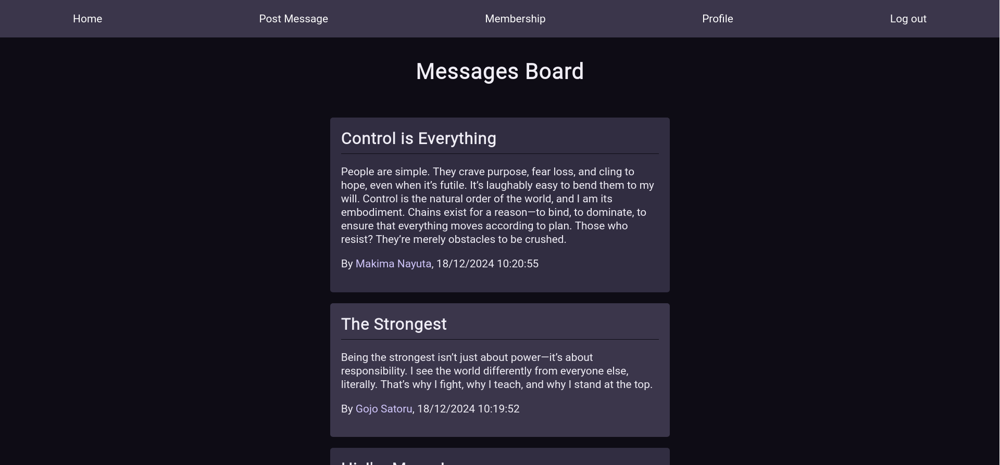

    
    <h1>Message Board</h1>
    
Message webpage

    

        <a href="https://members-only-production-a322.up.railway.app/" target="_blank" rel="noreferrer noopener">View Demo</a> · 
        <a href="https://github.com/jotafer19/members-only/issues" target="_blank" rel="noreferrer noopener">Report Bug</a> ·
        <a href="https://github.com/jotafer19/members-only/issues" target="_blank" rel="noreferrer noopener"> Request Feature</a>
    

## Preview

### Features

- A webpage built using React and responsive design and with accessibility in mind.
- You can filter shop products by their category and sort them by different options: recommended, price or alphabetical order.
- Checkout page where you can add more items or remove them.

### Built With

- 
- 
- 

### Tools Used

- 
- 
- 

## Outcome

- Used **Express** and **PostgreSQL** to build a webpage where members can write anonymous posts. Inside the clubhouse, members can see who the author of a post is, but outside they can only see the story and wonder who wrote it.
-  It allows users to create and delete letters, providing a simple interface for communication.
- Used **Git** and **GitHub** for project management, and **Netlify** to deploy it.
- Tried to maintain **clean code**.

## What I learned

- Deeper understanding of Express and PostgreSQL.
- Dealing with error handling.
- Every component has been **tested**.

## Acknowledgments

- Inspiration by [**The Odin Project**](https://www.theodinproject.com/lessons/node-path-nodejs-members-only).